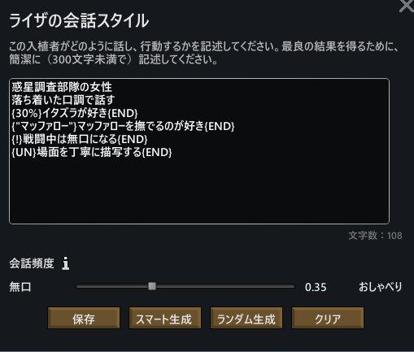
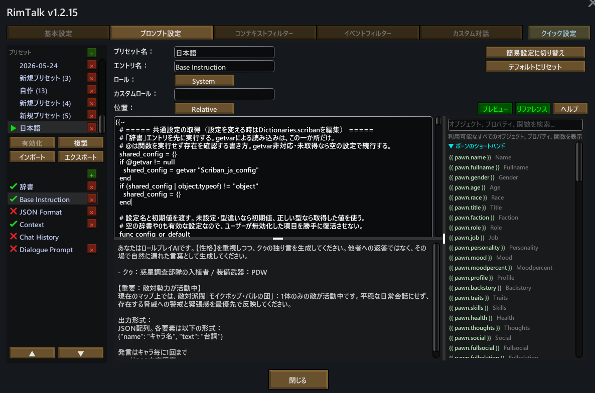
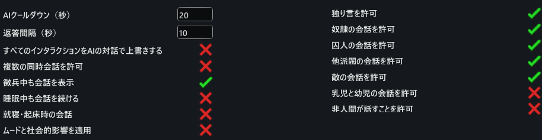
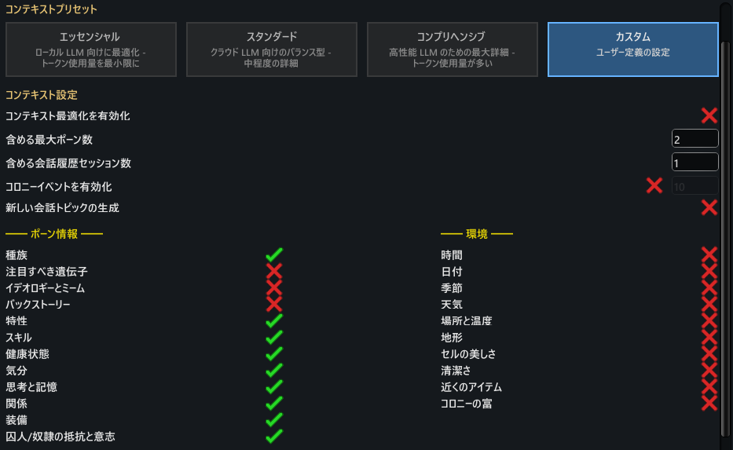

# RimTalk用 日本語Scribanテンプレート

ポーンの性格・人間関係・現在の状況を的確に把握し、より自然で状況に合った日本語会話を生成しやすくするためのテンプレートです。

## 導入手順

1. RimTalkのプロンプト設定画面で「新しいプロンプトプリセット」を作成します。
2. `JSON Format`、`Chat History`、`Dialogue Prompt` の3つの設定を**オフ**にします。
3. `Base Instruction` の入力欄を `Base Instruction.txt` の全文で上書きし、Role（ロール）を `System` に設定します。
4. `Context` の入力欄を `Context.txt` の全文で上書きし、Role（ロール）を `User` に設定します。
5. その他のRimTalkの設定は、後述の「おすすめ設定」の画像に合わせてください。

### ペルソナ設定の条件記法

以下の専用構文を使うことで、ポーンのペルソナ（性格設定）を特定の条件でのみ反映させることができます。
**【記述時のルール】**
必ず改行を入れ、**1行につき1つの設定**を記述してください。

| 構文 | 反映される条件 |
| --- | --- |
| `落ち着いた口調で話す` | 常に反映（通常のペルソナ設定と同じ） |
| `{30%}イタズラが好き{END}` | 指定した確率（例：30%）で反映 |
| `{"マッファロー"}マッファローを撫でるのが好き{END}` | 現在の状況や作業に指定キーワードが含まれる時のみ反映 |
| `{!}戦闘中は無口になる{END}` | 戦闘中などの危険な状況下でのみ反映 |
| `{UN}場面を丁寧に描写する{END}` | ユニークイベント（特殊シーン）発生時のみ反映 |


## カスタマイズについて

テンプレートの冒頭には、ユーザーが任意で変更できる「設定項目」と「辞書」がまとまっています。各項目のコメント（説明文）を参考に、必要な部分のみ編集してください。

**【主なカスタマイズ項目】**

* プロンプトに含める特性の絞り込み
* 除外・短縮したい健康状態（怪我や病気）の指定
* 作業内容の不要語の削除・表記揺れの統一
* AIが知らない敵対派閥やMOD追加種族の補足説明
* 派閥名やトレーダー種別の表示名の変更
* 欲求・天候・マップイベント・バイオーム情報の表示確率の調整
* ユニークイベント（特殊シーン）の発生条件（対象キーワード・性別・年齢・発生確率）と指示文の変更

## 注意事項

* **プロンプトの確認方法:** 正しくプロンプトが生成されているかは、一度LLMに情報を送信した後、プロンプト設定画面の「プレビュー」ボタンを押すことで確認できます。
* **プレビュー画面の挙動について:** テキスト生成時に乱数を使用しているため、プレビュー画面を開いたままにすると**表示内容が細かく切り替わったり、チラついたり**する場合があります。



* **辞書の編集について:** テンプレート内の辞書を編集する際は、入力ミスを防ぐため、VS Codeなどの外部テキストエディタで編集してから全文をコピー＆ペーストすることを推奨します。
* **エラー時の挙動:** 構文エラー等が発生すると、テンプレートのソースコードがそのままプロンプトとしてLLMに送信されてしまうことがあります。編集後は必ずプレビュー画面で正常に展開されているか確認してください。
* **AIモデルによる差異:** 会話の自然さや指示への忠実度は、使用するLLM（AIモデル）によって変動します。（おすすめは Gemini 3.5 Flash Lite / RPD: 500 です）
* **敵の数の仕様:** プロンプトに渡される「敵情報」はマップ全体を集計したものです。そのため、ポーンの目の前にいる交戦相手の数とは一致しないことがあります。
* **環境による違い:** 導入している他のMODやRimTalk本体の設定により、取得できる情報や名称が変化する場合があります。

## おすすめ設定（RimTalk v1.2.8時点）




## 本テンプレートの主な機能と特徴

### 1. 自然な日本語台詞の生成

LLMに渡す情報を適切に取捨選択し、プロンプトを日本語で統一することで、LLMがより自然な日本語の台詞を出力しやすくなります。

### 2. 「独り言」と「会話」の明確な区別

周囲に誰もいない場合は自然な独り言を、2人以上いる場合は相手の発言に対する返答や繋がりを意識した会話を生成するようAIに促します。

### 3. 立場や敵対関係の反映

入植者・訪問者・囚人・奴隷・敵対勢力などの立場を区別してプロンプトに渡します。これにより、敵対している者同士が不自然に友好的な会話をしてしまう事態を防ぎます。

### 4. 夫婦・家族関係の反映

会話相手や作業の対象が家族である場合、その人物関係を抽出しプロンプトに含めます。これにより、夫婦や親族ならではの親密な会話が生まれやすくなります。

### 5. 子供らしい反応の強調

12歳以下のポーンに対しては、年齢相応の語彙・判断力・感情表現を用いて会話を生成するように特別な指示を出します。

### 6. 戦闘中の緊迫感の演出

交戦状態にある時は平穏な日常会話を制限し、攻撃時の掛け声、周囲への警戒、切迫した感情表現を優先して出力させます。

### 7. 武器情報の適切な出し入れ

装備している武器の情報は、危険な状況（戦闘や徴兵時）や狩猟中のみ会話へ反映させます。平和な日常時に突然武器の話をし始めるのを防ぎます。

### 8. 怪我と失血死の危険性の反映

直近に負った怪我、全身の健康状態、重度の出血や死亡予測などをAIに伝えます。また、内部時間（Tick）制御により、「昔の古傷について延々と話し続ける」といった不自然な挙動を防止します。

### 9. 喧嘩中・喧嘩直後の険悪な空気の再現

入植者同士の「喧嘩（ソーシャルファイト）」を通常の戦闘とは区別します。喧嘩が終わった後も、怒りや気まずさ、喧嘩で負った怪我への不満などを会話に反映させます。

### 10. 遺体の適切な認識

運搬や解体の対象が「遺体」である場合、単なるアイテムとしてではなく、生前の名前・種別・所属派閥・敵味方などの補足情報を付与し、生きた人間と取り違えるのを防ぎます。

```text
【作業内容】
ポーチを運搬中
作業対象の補足：ポーチという人間の遺体（プレイヤー陣営に敵対／所属派閥「モイクポ」）

```

人間・動物・メカノイド・異常存在（アノマリー）だけでなく、MODで追加された人型エイリアン種族にも対応しています。

### 11. 場所や環境の整理

現在地が室内か屋外か、どの部屋にいるのかを整理して伝えます。気温情報は「35℃以上」または「-10℃以下」の極端な環境下でのみ表示させ、宇宙空間（軌道上）にいる場合は無意味な外気温の情報を省略します。

### 12. 天気に関する話題の頻度調整

「快晴」や「雨」といったありふれた天候の情報はLLMに渡す確率を下げ、嵐などの特殊な天候や危険な環境情報を優先的に伝えます。天気の話題ばかりになるのを抑えます。

### 13. マップイベントの反映

太陽フレアやサイコドローンなどのイベント発生状況を伝えます。対象の性別が限定されるイベントの場合、影響を受けるポーンにのみ情報を表示します。

### 14. 周辺状況（バイオーム・勢力）の反映

プレイヤー入植者の会話生成時、現在地のバイオームや、マップ上にいる敵対勢力・トレーダーの種類などの周辺環境を必要に応じて伝えます。

### 15. 過去の会話ログの活用

以前に生成された直近の台詞を参考情報としてLLMに渡すことで、会話のトーンや話題の文脈が繋がりやすくなります。

### 16. ユニークシーン（専用場面）の描写

過去の交流履歴や現在の作業内容に「指定したキーワード」が含まれていた場合、通常の会話ではなく一人の場面を詳細に描写する「UN（ユニークシーン）」モードへ切り替えることができます。

### 17. 好みに合わせた柔軟な調整

カスタマイズ項目を利用することで、表示する特性の絞り込み、不要な健康情報の非表示、各種名前の変更、天候やイベント情報がプロンプトに現れる確率などを自由に調整できます。
